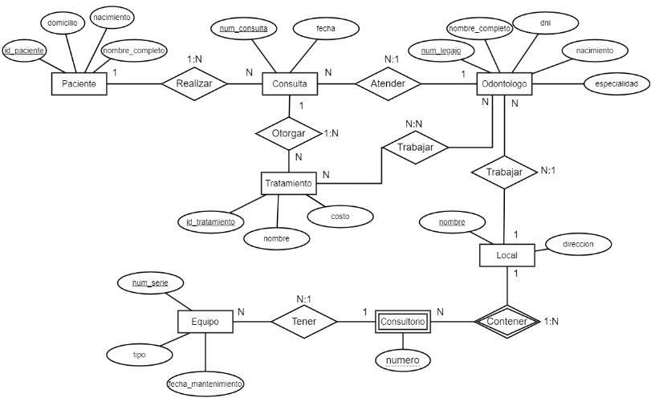

# Queries SQL - Consultorio Odontologico

En este proyecto se quiere modelar la actividad de una **clinica odontologica**
de acuerdo a las siguientes reglas de negocio:

- La clínica está compuesta por varios locales identificados por su nombre, es de interés almacenar la dirección de los mismos. En cada local existen consultorios odontológicos identificados por números, dentro de los mismos se encuentra a disposición de los profesionales de salud cierto equipamiento

* Los equipos están identificados por número de serie, tipo y fecha de último mantenimiento.

- Los odontólogos son identificados por número de legajo, nos interesa almacenar de los mismos información de su nombre completo, dni fecha de nacimiento especialidad odontológica y nombre del local en la cual trabaja.

* Los pacientes que son atendidos por odontólogos reciben de estos una consulta donde se le asigna un tratamiento

## Diagrama Entidad-Relacion propuesto

